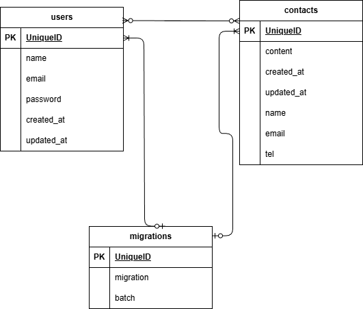

# お問い合わせフォーム

会員登録されている顧客からお問い合わせを受けるためのページ。また会員登録されていな方は新規会員登録可能。

## 環境構築

#### リポジトリをクローン

```
git clone git@github.com:asaumareru2-cmd/contact-form3.git
```

#### Laravelのビルド

```
docker-compose up -d --build
```

#### Laravel パッケージのダウンロード

```
docker-compose exec php bash
```

```
composer install
```

#### .env ファイルの作成

```
cp .env.example .env
```

#### .env ファイルの修正

```
DB_HOST=mysql

DB_DATABASE=laravel_db

DB_USERNAME=laravel_user

DB_PASSWORD=laravel_pass
```

#### キー生成

```
php artisan key:generate
```

#### マイグレーション・シーディングを実行

```
php artisan migrate
```

## 使用技術（実行環境）

フレームワーク：laravel

言語：日本語

Webサーバー：nginx

データベース：mysql

## ER図



## URL

アプリケーション：http://localhost/

管理画面：◯◯◯◯◯ ◯◯◯◯ ◯◯◯◯

phpMyAdmin：http://localhost:8080/

